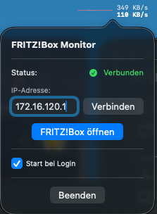

# 📉 FRITZ!Box Traffic Monitor for macOS

A lightweight, native macOS menu bar application that monitors your FRITZ!Box internet traffic in real-time. Built purely with **SwiftUI** and **Network.framework**, it offers a seamless integration into the macOS menu bar without cluttering your dock.

## ✨ Features

*   **Live Traffic Graph:** Visualizes Upload (top/red) and Download (bottom/blue) separately in a split-view graph.
*   **Native Design:** Uses a compact, pixel-perfect layout that fits perfectly into the macOS menu bar.
*   **Auto-Discovery:** Automatically finds your FRITZ!Box in the local network via TCP check (Port 49000).
*   **Zero Distraction:** Runs as a menu bar agent (no Dock icon, no main window).
*   **Instant Access:** Quick link to open the FRITZ!Box web interface.
*   **Smart Fallback:** Includes a manual IP input field if auto-discovery fails.
*   **Auto-Start:** Option to automatically launch the app at login via a simple toggle in the menu (requires macOS 13+).

## 🚀 Installation

1.  Download the latest release from the [Releases page](#).
2.  Drag the App into your `Applications` folder.
3.  Right-click and select **Open** (required for non-notarized apps) to start.

## ⚙️ Requirements

*   **macOS:** 11.0 (Big Sur) or later.
*   **FRITZ!Box:** UPnP status information must be enabled.
    *   Go to `Heimnetz` > `Netzwerk` > `Netzwerkeinstellungen`.
    *   Enable: **"Statusinformationen über UPnP übertragen"**.

## 🛠️ Built With

*   **Swift 5**
*   **SwiftUI** (User Interface)
*   **Combine** (Data Binding)
*   **Network.framework** (Connection Checks)

## 🚀 Auto-Start on Login

You can set the app to start automatically whenever you log in to your Mac:
1. Click on the menu bar graph to open the settings popover.
2. Toggle the checkbox **"Start bei Login"** (Start at Login).
3. If prompted by macOS, allow the app to run in the background ("Login Item").

*Note: This feature uses the modern `SMAppService` API and requires macOS 13 (Ventura) or newer.*

## 🔧 How it works

The app polls the FRITZ!Box every second using the **TR-064 / UPnP SOAP API** (`WANCommonInterfaceConfig`). It retrieves `NewByteReceiveRate` and `NewByteSendRate` and visualizes the history in a custom SwiftUI `Path` drawing.

## 📝 License

Distributed under the MIT License. See `LICENSE` for more information.

---
*Note: This project is not affiliated with AVM GmbH.*

